# Google AI Essentials - Course Notes

## Course 1: Introduction to AI

### Core Concepts

**Cognitive Tasks**: AI handles thinking, doing, and solving tasks.

**Machine Learning**: Built through training with datasets.

### Generative AI Workflow

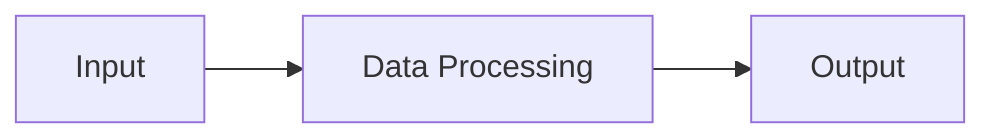

**Example Tool**: Gemini (Conversational AI Tool)

### AI Limitations ⚠️

| Limitation | Description |
|------------|-------------|
| **No Independent Learning** | Cannot learn without training data |
| **Bias Amplification** | Can reflect or amplify existing biases |
| **Hallucination** | AI output that does not make sense or is factually incorrect |

---

## Course 2: Maximize Productivity With AI Tools

### Key Concepts

**Human-in-the-Loop (HIL)**: A strategy that combines machine and human intelligence to train, use, verify, and refine AI models.

**GenAI**: Bringing ideas to life through generative AI tools.

### Types of AI Solutions

| Type | Description | Example |
|------|-------------|---------|
| **Standalone AI Tool** | Unique app for specific purpose | Speeko (voice communication) |
| **Custom AI Feature** | Specific feature integration | Email auto-complete |
| **AI Model** | Trained model powering AI tools | GPT, Gemini |
| **AI Agent** | Autonomous task performer with minimal oversight | Auto email responder, social media poster |

### AI Model Training Process

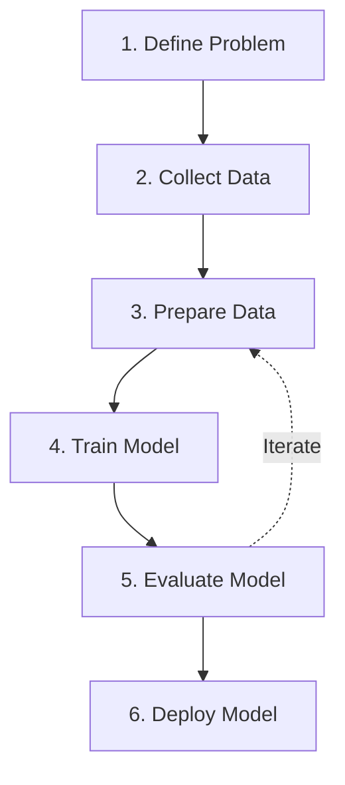

### GenAI Tools by Category

#### 📝 Text and Content Generation

- **Gemini** - Google's conversational AI
- **NotebookLM** - Note-taking and research
- **Anthropic Claude** - Advanced language model
- **ChatGPT** - OpenAI's conversational AI
- **Clockwise** - Calendar optimization
- **Grammarly** - Writing assistant
- **Jasper** - Content creation
- **Microsoft Copilot** - Microsoft 365 integration
- **Notion AI** - Workspace enhancement
- **Zapier** - Workflow automation

#### 💻 Code Generation

- **Gemini Code Assist** - Google's coding assistant
- **GitHub Copilot** - AI pair programmer
- **Jupyter AI** - Notebook AI integration
- **Tabnine** - Code completion

#### 🎨 Image and Media Generation

- **Gemini with Nano Banana** - Google's image generation
- **Asset Studio** - Design asset creation
- **Adobe Firefly** - Adobe's generative AI
- **Canva Magic Design™** - Design automation
- **DALL-E** - OpenAI's image generator
- **ElevenLabs** - Voice synthesis
- **Midjourney** - AI art generation
- **Runway** - Video and media creation

### AI Integration Strategy

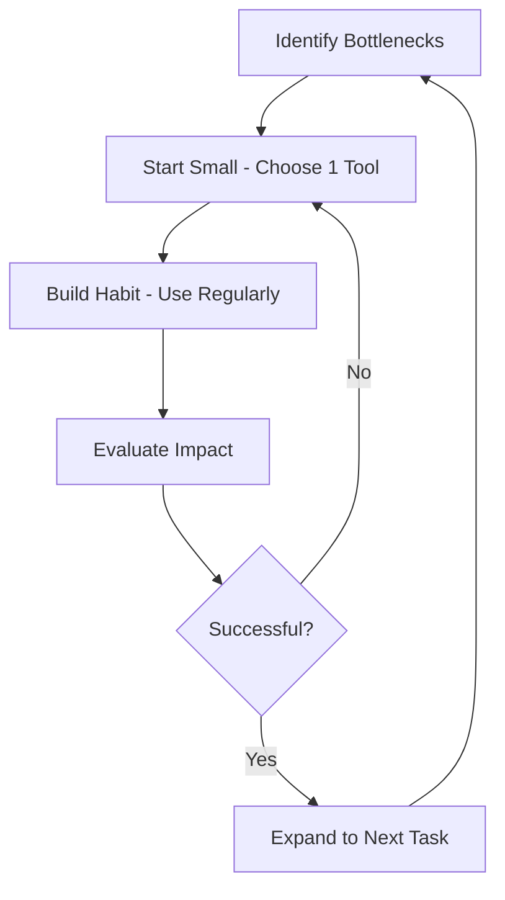

**Key Steps**:
1. **Identify bottlenecks** - Find time-consuming or repetitive tasks
2. **Start small** - Choose one tool for one specific task
3. **Build a habit** - Make it a natural reflex
4. **Evaluate and expand** - Assess impact after 1-2 weeks

### Human-in-the-Loop Process

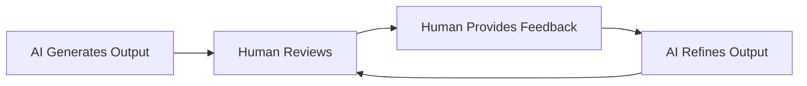

**Example**: Insurance company using AI for customer inquiries with human verification.

### Important Concepts

**Knowledge Cut-off**: AI lacks recent data beyond its training period, which can lead to hallucinations.

**Integration**: Gemini integrates with Google Workspace (Sheets, Slides, Docs). Similarly, Copilot integrates with Microsoft 365 tools.

---

## Course 3: Discover the Art of Prompting

### How LLMs Work

**Large Language Models (LLMs)** predict text using probability and statistics. Understanding their limitations helps avoid hallucinations and improves output quality.

### Effective Prompt Components

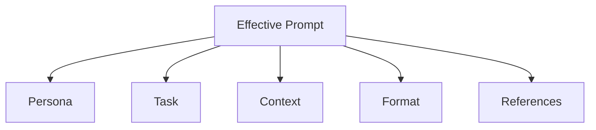

#### 1. **Persona**
What expertise should the AI use? Who is the audience?

*Example*: "You're an IT professional..." or "Create output for managers..."

#### 2. **Task**
Clear, specific description of what you want the AI to do.

*Example*: "Create a social media post about an upcoming music festival..."

#### 3. **Format**
How should the output be structured?

*Example*: "Bulleted list", "Comparison table", "125-character limit"

#### 4. **Context**
Additional information the AI needs:

| Context Type | Description |
|--------------|-------------|
| **Reasons & Objectives** | Why you're performing the task |
| **Rules & Guidelines** | Constraints the output must follow |
| **Background Information** | Relevant details to consider |

#### 5. **References**
Supporting materials like documents, images, or data that provide additional details.

### Complete Prompt Example

> **Task**: Create a social media post about an upcoming music festival that speaks to the local music community while attracting out-of-state festival-goers.
>
> **Persona**: You're a concert promoter specializing in raising ticket sales in the alternative rock music industry.
>
> **Format**: Limit the post to 125 characters. Include 5 relevant hashtags.
>
> **Context**: The local audience is primarily college students and young professionals (age 21-35) who follow indie rock. The festival features 12 bands over 2 days, with camping options and local food vendors.

### Evaluating AI Output

| Criterion | What to Check |
|-----------|---------------|
| **Accuracy** | Is the information correct? |
| **Bias** | Does it show unfair prejudice? |
| **Relevancy** | Does it address the prompt? |
| **Consistency** | Is the output coherent? |

### Iterative Refinement Process

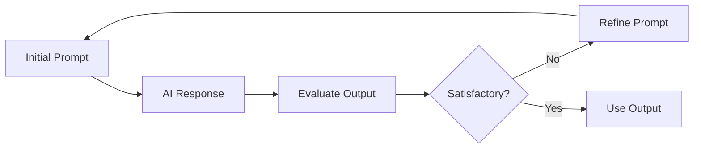

### Action Verbs for Different Tasks

| Task Type | Verbs to Use | Example |
|-----------|--------------|---------|
| **Content Creation** | Create, Write, Generate | "Create an article about..." |
| **Summarization** | Summarize, Condense | "Summarize this document..." |
| **Classification** | Classify, Categorize | "Classify these items..." |
| **Extraction** | Extract, Identify | "Extract key points from..." |
| **Translation** | Translate, Convert | "Translate this text to..." |

---

## Advanced Prompting Techniques

### Shot Prompting

Different levels of providing examples:

| Type | Description | When to Use |
|------|-------------|-------------|
| **Zero-Shot** | No examples provided | Simple, straightforward tasks |
| **One-Shot** | One example given | Medium complexity tasks |
| **N-Shot** | Multiple examples | Complex patterns or formats |

### Chain-of-Thought Prompting

Ask the LLM to explain its reasoning process.

**Key Phrases**:
- "Explain your reasoning"
- "Go step by step"
- "Show your work"

**Example**:
> Create a bulleted list outlining the major duties and responsibilities of a new entry-level design hire at an ad agency. **Explain your reasoning step by step.**

### Prompt Chaining

Break complex tasks into smaller steps, using each output as input for the next prompt.

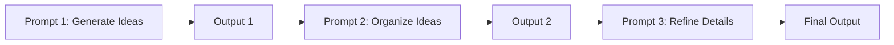

#### Three Key Steps

1. **Task Analysis** - Break down complex task into logical steps
2. **Initial Prompting** - Craft focused prompt for first step
3. **Input/Output Flow** - Use each output as context for next prompt

#### Example: Trip Planning

**Prompt 1**:
> I'm going to [city name] for 3 days. I like art, historical sites, and parks. Suggest a few well-known places I could visit on my trip.

**Prompt 2** (chained):
> Using those locations, create a logical, day-by-day itinerary that minimizes travel time.

**Prompt 3** (chained):
> For each day of the itinerary, suggest a few restaurants located near each of the suggested locations.

### Combining Chain-of-Thought + Prompt Chaining

**Example: Book Club**

**Prompt 1**:
> I am hosting a book club and would like fantasy book recommendations for people that are new to reading this genre. Suggest a few books that we could use.

**Prompt 2** (combined technique):
> From that list, can you suggest which book you would recommend if we are looking for a fast-paced read? **Explain your reasoning.**

### Challenges and Solutions

#### Problems with Long Prompt Chains

| Problem | Description |
|---------|-------------|
| **Context Loss** | AI forgets earlier conversation details |
| **Inconsistency** | Responses may contradict earlier outputs |
| **Goal Drift** | AI loses sight of overall objective |

#### Solutions

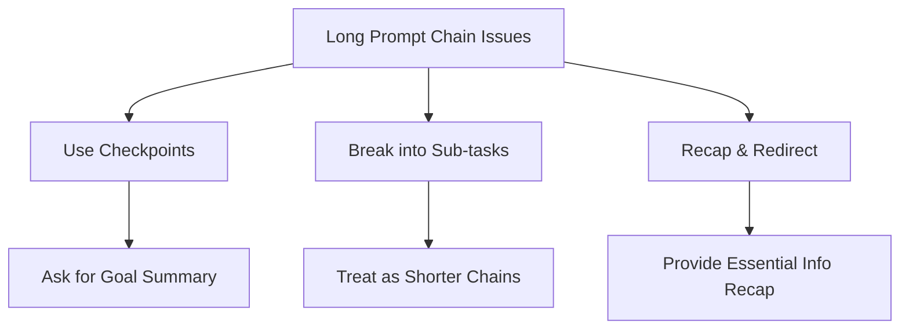

| Solution | How to Apply |
|----------|--------------|
| **Use Checkpoints** | Periodically ask AI to summarize the overall goal |
| **Work on Sub-tasks** | Divide complex tasks into smaller chains |
| **Recap and Redirect** | Remind AI of essential information if it deviates |

---

## Summary

### Key Takeaways

1. **AI has limitations** - Be aware of hallucinations, biases, and knowledge cut-offs
2. **Human-in-the-Loop is essential** - Always verify and refine AI outputs
3. **Start small with AI tools** - Focus on one bottleneck at a time
4. **Craft effective prompts** - Use persona, task, context, format, and references
5. **Iterate and refine** - Evaluate outputs and adjust prompts accordingly
6. **Use advanced techniques** - Chain-of-thought and prompt chaining for complex tasks

### Practical Application Framework

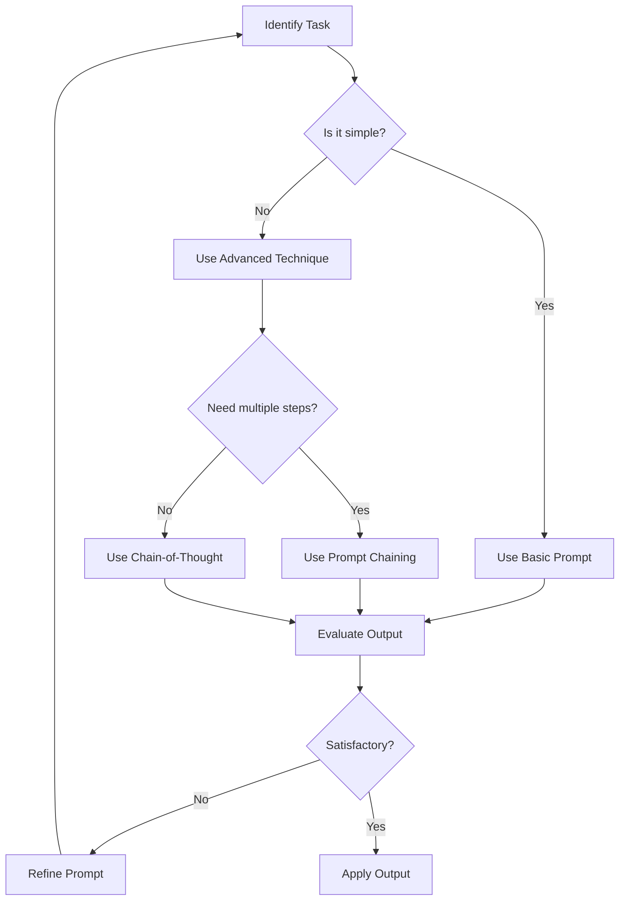

---

## Course 4: Use AI Responsibly

### Understanding AI-Related Harms

Responsible AI usage requires understanding potential harms that AI systems can cause to individuals and society. These harms fall into four main categories:

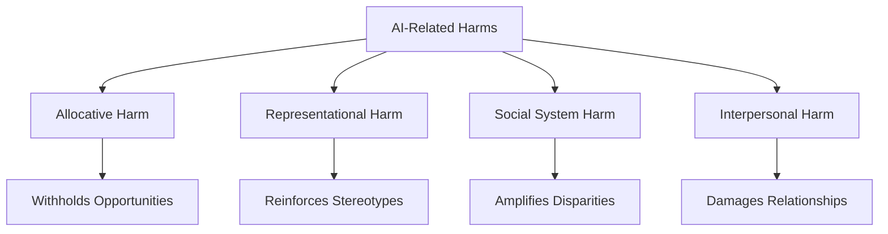

### 1. Allocative Harm ⚖️

**Definition**: A wrongdoing that occurs when an AI system withholds opportunities, resources, or information that affects a person's wellbeing.

#### Key Characteristics

| Aspect | Impact |
|--------|--------|
| **Scope** | Education, healthcare, housing, employment |
| **Mechanism** | Unequal access to information or services |
| **Consequence** | Denied opportunities for affected individuals |

#### Real-World Examples

**❌ Problematic Scenario**:
> An AI-powered job screening tool filters out qualified candidates from certain zip codes, assuming they lack necessary skills based on historical data patterns.

**✅ Responsible Approach**:
> Regularly audit AI systems for equal access across different demographic groups and geographic locations. Ensure information and opportunities are distributed fairly.

**Impact Illustration**:

```
Equal Access ✓          vs.     Allocative Harm ✗
━━━━━━━━━━━━━━                 ━━━━━━━━━━━━━━━━━━
👥 Group A: 100%                👥 Group A: 100%
👥 Group B: 100%                👥 Group B: 45%
👥 Group C: 100%                👥 Group C: 60%
```

---

### 2. Representational Harm 🎭

**Definition**: An AI tool's reinforcement of the subordination of social groups based on their identities.

#### How It Manifests

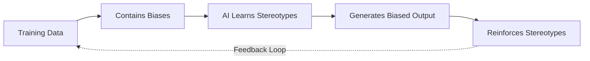

#### Common Examples

| Scenario | Harm Type | Impact |
|----------|-----------|--------|
| Language translation assuming gender roles | Stereotype reinforcement | Associates "doctor" with male, "nurse" with female |
| Image generation depicting professions | Visual stereotyping | Generates CEOs as predominantly one demographic |
| Voice assistants defaulting to gendered voices | Identity subordination | Reinforces service roles as feminine |

#### Example: Language Translation Bias

**Input**: "The doctor examined the patient. The nurse prepared the medication."

**❌ Biased Translation**:
```
"El médico examinó al paciente" (masculine form assumed)
"La enfermera preparó la medicina" (feminine form assumed)
```

**✅ Responsible Approach**:
- Request gender-neutral translations when possible
- Specify gender explicitly in prompts
- Use AI tools that offer multiple translation options
- Provide context to avoid assumptions

---

### 3. Social System Harm 🌍

**Definition**: Macro-level societal effects that amplify existing class, power, or privilege disparities, or cause physical harm through AI development or use.

#### Major Concerns

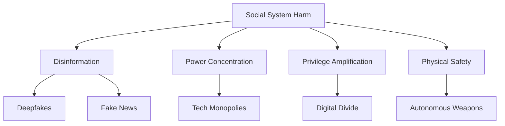

#### Deepfakes: A Critical Threat

**Deepfakes**: AI-generated fake photos or videos of real people saying or doing things they never did.

**Risk Assessment**:

| Risk Level | Type | Example | Mitigation |
|------------|------|---------|------------|
| 🔴 **Critical** | Political manipulation | Fake videos of leaders declaring war | Verify sources, use detection tools |
| 🟠 **High** | Financial fraud | Fake CEO requesting urgent transfers | Multi-factor authentication |
| 🟡 **Medium** | Reputation damage | Fabricated compromising content | Digital watermarking, fact-checking |

#### Real-World Impact Example

**Scenario**: A deepfake video spreads before an election
```
Time: T+0h → Fake video released
Time: T+2h → 1M views, viral spread
Time: T+6h → Fact-checkers respond
Time: T+12h → 10M views (damage done)
```

**Protection Strategies**:
- ✓ Verify information from multiple trusted sources
- ✓ Look for verification badges and official channels
- ✓ Use reverse image/video search tools
- ✓ Be skeptical of sensational content
- ✓ Report suspected deepfakes to platforms

---

### 4. Interpersonal Harm 💔

**Definition**: The use of technology to create disadvantages that negatively affect relationships or cause loss of one's sense of self and agency.

#### Forms of Interpersonal Harm

| Type | Description | Example |
|------|-------------|---------|
| **Identity Theft** | AI-generated impersonations | Voice cloning for fraud |
| **Harassment** | Automated or AI-assisted bullying | Coordinated bot attacks |
| **Manipulation** | Personalized deception | AI-crafted phishing attempts |
| **Privacy Invasion** | Unauthorized data usage | Face recognition without consent |

#### Impact on Relationships

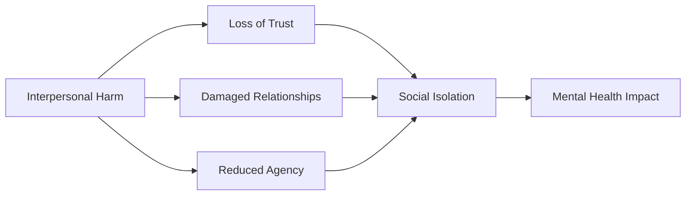

**Self-Protection Checklist**:
- [ ] Be cautious sharing personal information with AI tools
- [ ] Understand privacy policies before using AI services
- [ ] Recognize AI-generated manipulation attempts
- [ ] Maintain human connections alongside AI interactions
- [ ] Report harmful AI-enabled behaviors

---

### Understanding AI Drift

**Drift**: The gradual decline in an AI tool's accuracy and relevance as the real world changes.

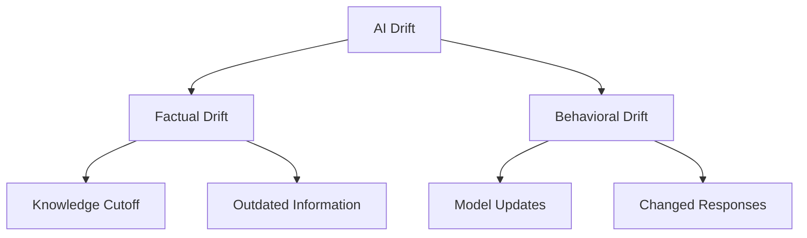

### Types of Drift

#### 1. Factual Drift 📅

**Definition**: AI accuracy decreases over time due to knowledge cutoff.

**Timeline Example**:

```
Model Training: January 2024
━━━━━━━━━━━━━━━━━━━━━━━━━━━━━━━━━━━
Query in Jan 2024:  ✓ Accurate (0 months old)
Query in Jun 2024:  ⚠ Slightly outdated (5 months old)
Query in Jan 2025:  ✗ Significantly outdated (12 months old)
Query in Jan 2026:  ✗✗ Very outdated (24 months old)
```

**Topics Most Affected**:
- 🔄 Technology trends and software versions
- 📈 Financial markets and economic data
- 👔 Fashion and cultural trends
- 🏛️ Political landscapes and policies
- 📊 Scientific research and discoveries
- 🌐 Social media platforms and features

**Example - Fashion Trends**:

❌ **Outdated Response** (2026 query, 2024 training):
> "Current fashion trends include oversized blazers and Y2K aesthetics popular in 2024..."

✅ **Mitigated Response**:
> "You're a fashion consultant. Based on current street style observations in major fashion capitals as of January 2026, what trends are you seeing? Consider that my training data extends only to 2024."

#### 2. Behavioral Drift 🔄

**Definition**: Changes in AI tool behavior, formatting, tone, or conversational style over time due to model updates.

**What Changes**:

| Aspect | Before Update | After Update |
|--------|---------------|--------------|
| **Formatting** | Bullet points default | Paragraph format default |
| **Tone** | Formal and structured | Conversational and casual |
| **Length** | Concise responses | Detailed explanations |
| **Style** | Technical terminology | Simplified language |

**Example Comparison**:

**Same Prompt**: "Explain machine learning"

**Version 1.0 Response**:
> Machine learning is a subset of artificial intelligence involving algorithms that learn from data...

**Version 2.0 Response** (after update):
> Hey! So machine learning is super interesting - basically, it's when computers learn patterns...

---

### Managing and Mitigating Drift

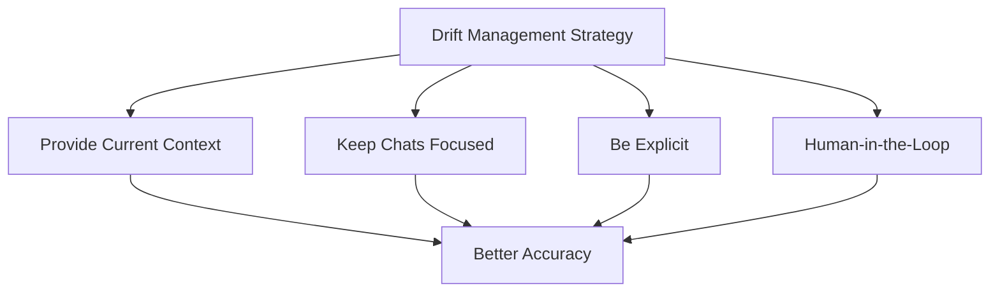

#### Strategy 1: Provide Accurate and Up-to-Date Context 📝

**How to Apply**:
- Include current date in your prompt
- Reference recent events or data
- Attach current documents or information
- Specify "as of [date]" for time-sensitive queries

**Before** (vulnerable to drift):
> "What are the best practices for remote work?"

**After** (drift-resistant):
> "Based on remote work trends as of January 2026, and considering the attached company survey from last month, what are the best practices for our hybrid team?"

#### Strategy 2: Keep Chats Focused 🎯

**Why It Matters**:
- Long conversations can lose context
- Topic switching confuses the AI
- Behavioral drift becomes more apparent

**Best Practices**:

| ✗ Avoid | ✓ Do Instead |
|---------|--------------|
| One chat for multiple unrelated tasks | New chat for each distinct task |
| Continuing 50+ message conversations | Start fresh after 10-15 exchanges |
| Mixing personal and work queries | Separate chats by context |
| Never resetting context | Clear chat when topic changes |

#### Strategy 3: Be Explicit with Instructions ✍️

**Clarity Checklist**:
- [ ] Specify exact format needed
- [ ] Define tone and style preferences
- [ ] Set clear length requirements
- [ ] Provide explicit constraints
- [ ] Use action verbs

**Vague Prompt**:
> "Tell me about climate change"

**Explicit Prompt**:
> "Create a 300-word executive summary about climate change impacts on coastal cities, written in formal tone, using bullet points for key risks, targeting a municipal government audience, current as of 2026."

#### Strategy 4: Maintain Human-in-the-Loop 👤

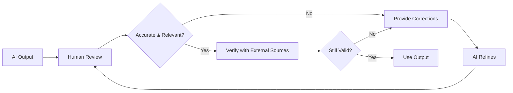

**Verification Steps**:
1. **Fact-check** critical information against current sources
2. **Cross-reference** with multiple AI tools or databases
3. **Consult experts** for domain-specific content
4. **Test outputs** in real-world scenarios
5. **Document limitations** and assumptions

---

### Responsible AI Usage Framework

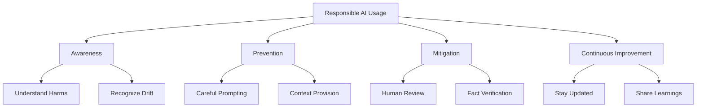

### Quick Reference: Responsible AI Checklist

Before using AI outputs:

**Harm Prevention**:
- [ ] Check for potential allocative harm (unequal access/opportunities)
- [ ] Review for representational harm (stereotypes/biases)
- [ ] Consider social system impact (broader societal effects)
- [ ] Assess interpersonal harm risks (relationships/privacy)

**Drift Mitigation**:
- [ ] Provide current date and context
- [ ] Use focused, single-purpose chats
- [ ] Include explicit, clear instructions
- [ ] Verify time-sensitive information
- [ ] Cross-check with current sources

**Quality Assurance**:
- [ ] Human review of all outputs
- [ ] Fact-check critical information
- [ ] Test in real scenarios
- [ ] Document assumptions and limitations
- [ ] Be transparent about AI usage

---

### Case Study: Responsible AI in Action

**Scenario**: Using AI to write a job description

**❌ Irresponsible Approach**:
```
Prompt: "Write a job description for a software engineer"
Result: May contain biased language, outdated requirements,
        exclude qualified candidates
```

**✅ Responsible Approach**:

**Step 1 - Careful Prompting**:
> "Create an inclusive job description for a mid-level software engineer position. Use gender-neutral language, focus on skills over credentials, emphasize outcomes rather than years of experience. Current date: January 2026. Include accommodations statement."

**Step 2 - Review Output**:
- Check for biased language (e.g., "rockstar," "ninja")
- Verify technical requirements are current
- Ensure inclusive language throughout
- Confirm accessibility is addressed

**Step 3 - Human Validation**:
- Have diverse team members review
- Compare with industry best practices
- Legal team reviews for compliance
- Test with bias-detection tools

**Step 4 - Iterate**:
- Refine based on feedback
- Update with current market data
- Ensure alignment with company values

---

### Key Takeaways

1. **Four Types of AI Harm**: Allocative, Representational, Social System, and Interpersonal - each requires specific awareness and mitigation strategies

2. **Drift is Inevitable**: Both factual and behavioral drift occur over time; proactive management is essential

3. **Context is Critical**: Always provide current, accurate context to combat knowledge cutoff limitations

4. **Human Oversight is Non-Negotiable**: AI should augment, not replace, human judgment and verification

5. **Responsibility is Shared**: Users, developers, and organizations all play roles in responsible AI usage

6. **Continuous Learning**: Stay informed about AI capabilities, limitations, and evolving best practices

### Practical Application

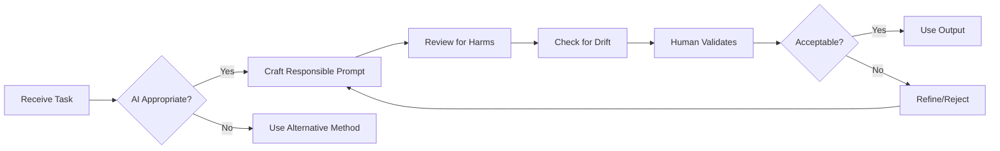

**Remember**: Responsible AI usage protects individuals, maintains trust, and ensures technology benefits everyone equitably. Your role as an AI user includes being vigilant about potential harms and actively working to mitigate them.
